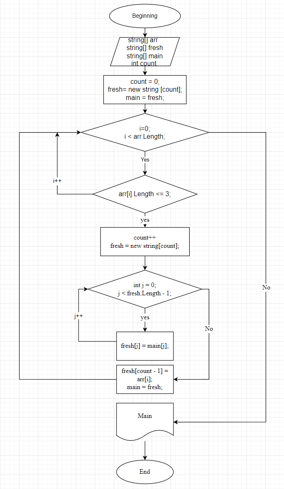

# Условие задачи:
<span style="color:rgb(0, 255, 0);font-Weight:100
;font-size:12px">

> ***Написать программу, которая из имеющегося массива строк формирует новый массив из строк, длина которых меньше, либо равна 3 символам.
> Первоначальный массив можно ввести с клавиатуры, либо задать на старте выполнения алгоритма.
> При решении не рекомендуется пользоваться коллекциями, лучше обойтись исключительно массивами.***

## Решение задачи:

```sh
  1. Создаем метод "Request" который запрашивает пользователя задать массив элементов, разделяя его (; ).
  2. Создаем функцию "GetArrLessOrEqualThreeSymbols", которая обработает введенный массив и преобразует его в массив,
     состоящий из элеменов массива равным или меньше трёх.
  3. Формируем невозвратную функцию "PrintArr" для вывода готового массива.
  4. Формируем дейтвия для вывода запроса данных и вывода конечного результата.
```


### Блок схема:


